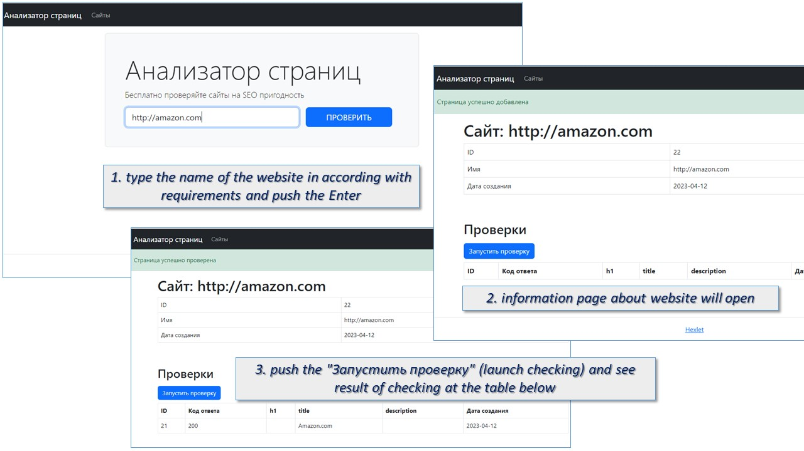

### hexlet test, linter status and maintainability:
[](https://github.com/ConstableFraser/python-project-83/actions)
[](https://github.com/ConstableFraser/python-project-83/actions/workflows/Linter.yml)
[](https://codeclimate.com/github/ConstableFraser/python-project-83/maintainability)

# PAGE SEO-ANALYZER
## useful features:
1. scanning main page of website for seo-suitability (tags: h1, title and description)
2. checking website for availability

## how it works:
1. type the name of the website in according with requirements and push the Enter
2. information page about website will open
3. push the "Запустить проверку" (launch checking)
4. see result of checking at the table below



## demo version:
https://page-analyzer-service.onrender.com/


**technical information**
python, poetry, flask, gunicorn, jinja2, beautifulsoup, psycopg2, postgresql, bootstrap


# HOW TO INSTALL AND USE

```
make install - to install dependencies
make start - to start the application
```
